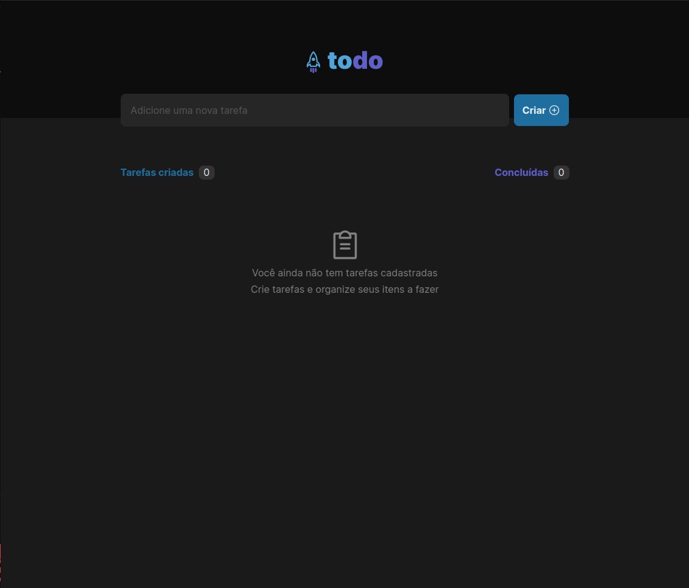
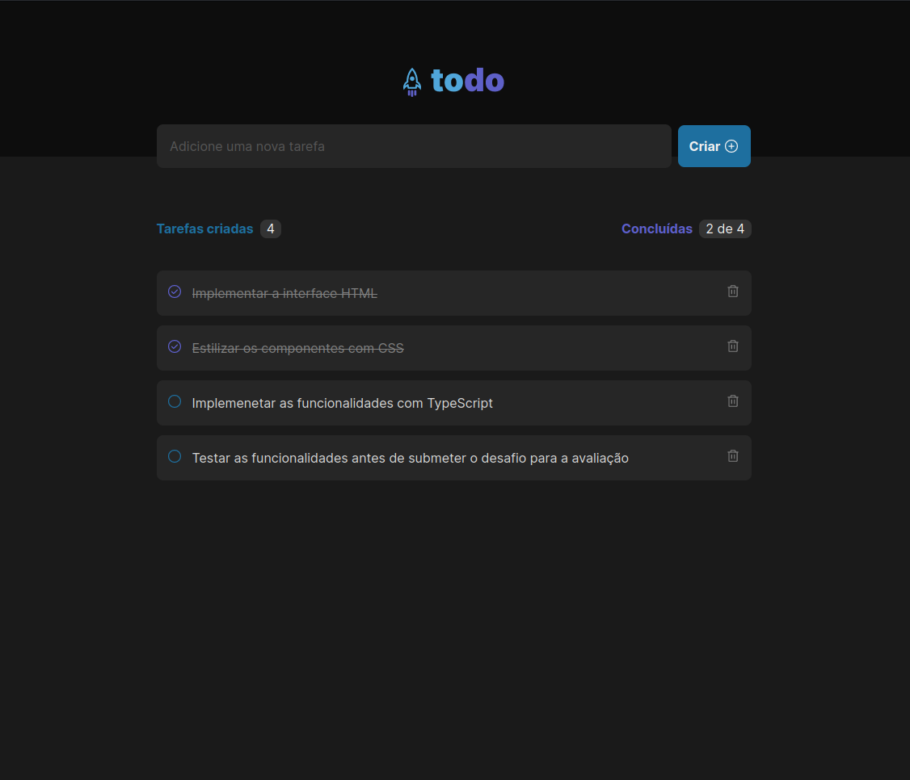

<h1 align="center">
  toDo 
</h1>

  
  

 

##  Projeto

O projeto foi desenvolvido em ReactJS para o primeiro desafio da Trilha de ReactJs, proposto no curso Ignite da Rocketseat.

## ✨ Tecnologias

Esse projeto foi desenvolvido com as seguintes tecnologias:

- [ReactJS](https://reactjs.org/)
- [TypeScript](https://www.typescriptlang.org/)

## Utilização do projeto

### 💾 Baixar o projeto
Faça o clone do repositório para ter uma versão do projeto em sua máquina: 
`$ git clone https://github.com/ViniciusPrataKloh/ignite-reactjs-desafio-01-todo.git`

### 🧰 Instalar dependências
`$ npm install`  

### 🚀 Iniciar o projeto
`$ npm run dev`
 

